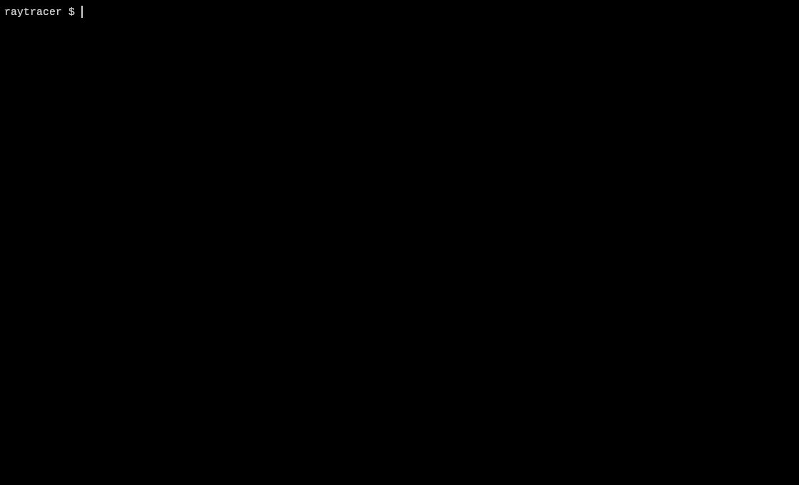
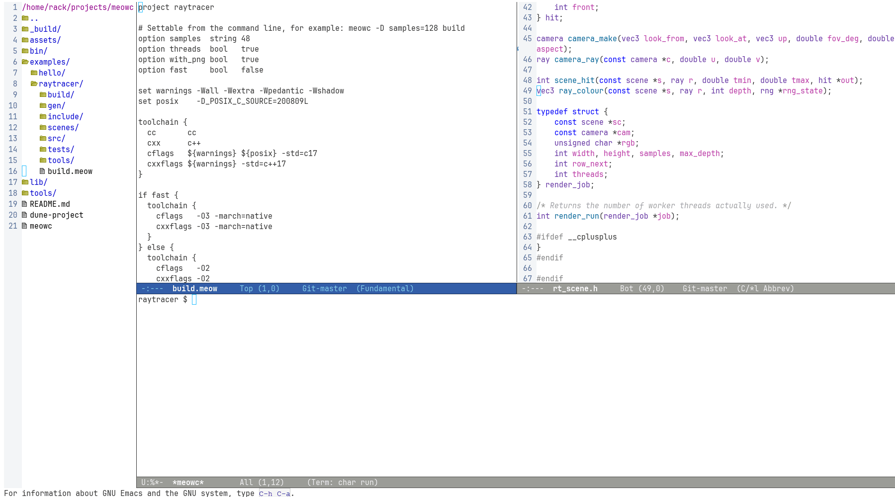

Build tool for C and C++ that derives the build graph and dependencies automatically, without needing Makefiles or generated build files



meowc tracks dependencies at the action level and only reruns actions whose inputs have changed. Outputs are compared by content so downstream actions are skipped when recompilation produces byte identical object files

Adding a declaration to a header that most of the project includes fans out to fourteen translation units across four targets, and nothing relinks, because a declaration emits no code and the objects come back byte identical



```
dune build && ln -sf _build/default/bin/meowc.exe meowc
cd examples/raytracer && ../../meowc build && ../../meowc test
```

A `run` block names a command and the targets it needs, which is how a project
drives something meowc does not build itself. `meowc run demo` builds those
targets and hands over, appending any arguments you pass after the name; with no
`use` it builds everything, as a bare `meowc build` does

```
run demo {
  use     help
  command guile --no-auto-compile main.scm
}
```

A rule runs because something needs the file it writes, a
run block runs because you asked for it, so a command that produces nothing has
somewhere to live

A rule can `use` a target, which is how a generator meowc builds itself gets both
ordering and invalidation: the tool is an input to the rule like any other file,
so it is linked before the rule runs and a change to it regenerates what it wrote

```
bin tablegen {
  srcs tablegen.c
}

rule tables {
  inputs  data/*.txt
  use     tablegen
  outputs gen/${stem}.c
  command ${builddir}/bin/tablegen ${in} ${out}
}
```

`meowc graph --show` renders the graph to SVG and opens it in the browser, which
is the one viewer everyone has that draws vectors rather than pixels. It uses
`$MEOWC_VIEWER`, then `$BROWSER`, then whichever of `firefox` or `xdg-open` is
installed. On a terminal `--dot` does the same, since raw graphviz on a screen is
for nobody, while a pipe or a redirect still writes the source

Tools are taken from the triple
prefix when a matching toolchain is installed, otherwise the host compiler is
invoked with `--target`. Each triple gets its own build directory and probe
cache, so host and cross trees do not invalidate each other, and the triple
drives `platform`, `arch`, `format` and the conditionals built on them

```
meowc --target x86_64-w64-mingw32 build
meowc --target aarch64-linux-gnu --sysroot /opt/sysroots/aarch64 build
```

Output names and link flags follow the object format rather than the operating
system. ELF gets `-fPIC`, `-shared` and `-Wl,-soname`, MachO gets `-dynamiclib`
and `-Wl,-install_name`, and COFF drops both the position independent code flag
and the soname, writing `rt.dll` next to the `librt.dll.a` that dependents link
against

`execve` weighs the arguments and the environment together against `ARG_MAX`, so
past a few thousand objects a link or archive step stops being able to start at
all. Commands meowc composes itself spill into a response file when they approach
that limit and run as `@file`, while the graph keeps the command it meant, so a
flag that only the response file ever sees still invalidates the action. A rule
runs an arbitrary program, which need not understand `@file`, and is left alone

## TODO

- Integrate precompiled headers into dependency tracking and invalidation
- Replace periodic mtime polling in `watch` with filesystem event notifications such as `inotify`
